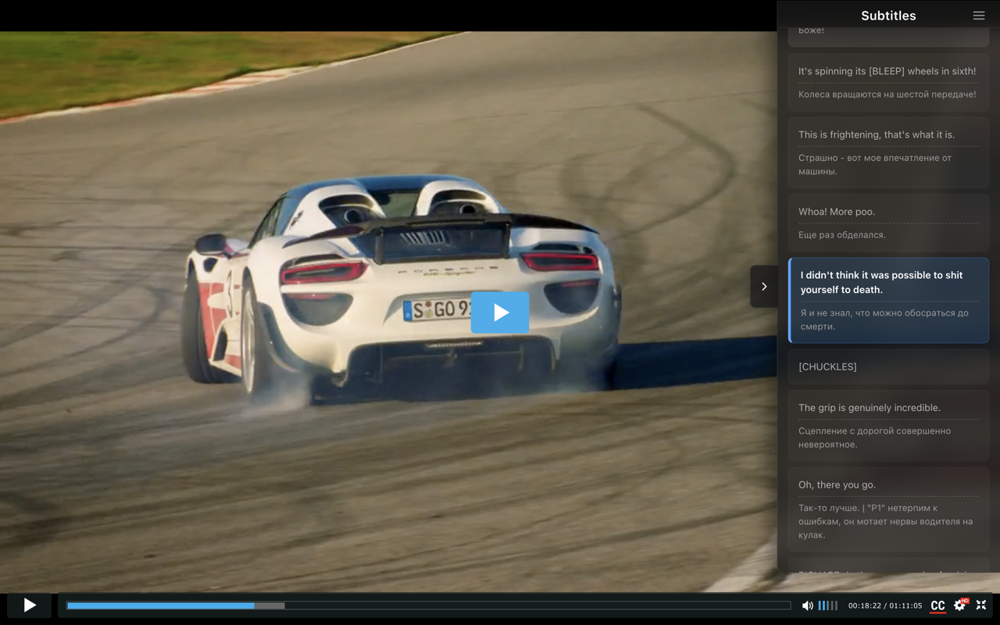

<div align="center">
  
  <h1>Learn languages while watching Rezka & YouTube</h1>
  <p><b>Interactive transcripts, dual subtitles, and one-click word capture into your Lingogram dictionary.</b></p>

  [](https://opensource.org/licenses/MIT)
  [](https://chrome.google.com/webstore)
  [](https://vitejs.dev/)
  [](https://www.typescriptlang.org/)
  [](PRIVACY_POLICY.md)
</div>

---

## 🌟 Overview

This repo ships **two Chrome extensions** that turn passive watching into active language learning:

- **Rezka** — for [rezka.ag](https://rezka.ag) / HDRezka. Intercepts native `.vtt` subtitle tracks.
- **YouTube** — for [youtube.com](https://youtube.com). Captures auto-generated and uploaded captions.

Both expose the same interactive transcript sidebar, dual-subtitle merging, and a "Sign in on Lingogram" flow that lets you save unknown words to your personal dictionary on [lingogram.app](https://lingogram-app.web.app) without leaving the video.

---

## 🚀 How it Works

1. **Open any video** on a supported site and enable captions in the native player.
2. The **transcript sidebar** appears with the full text, auto-scrolling to the current phrase.
3. **Load a second language** in the player to merge tracks into **Dual Mode**.
4. **Sign in on Lingogram** (one click in the popup → tab opens, you sign in once, the tab closes itself). The extension's service worker holds the auth handoff for future word captures.
5. **Highlight any word** in the transcript → the quick-add pill writes it to your Firestore inbox.
6. Visit [/student/vocabulary](https://lingogram-app.web.app/student/vocabulary) on Lingogram → the **Rezka** collection card shows pending words and drains them into your dictionary topic with one click.

---

## ✨ Key Features

### 📚 Synchronized Transcript Sidebar
The entire video text is available in an interactive sidebar. The current phrase is automatically highlighted and scrolled into view as the video plays.


### 🌐 Dynamic Dual Subtitles
Learn by comparing two languages side-by-side. Once you load two different tracks in the original player, the extension merges them for maximum contextual understanding.

### 🖱️ Interactive Navigation & Seeking
Click any sentence in the transcript to instantly jump to that specific moment in the video. Perfect for repeating difficult phrases or skipping ahead.

### 🎓 Smart Learning Modes
- **Dual Mode** — see both languages at once.
- **Guess Mode (Blur)** — hide the primary language and reveal it word-by-word or on hover to test your listening skills.
- Preferences persist across reloads via `chrome.storage`.

### 🔐 Lingogram Account Integration
- "Sign in on Lingogram" opens the web app's `/extension-auth?ext=<extId>` route in a tab. After auth, the tab forwards the Firebase `idToken` + `refreshToken` to the extension via `chrome.runtime.sendMessage` (gated by `externally_connectable` and a build-time origin allowlist).
- The service worker uses the token to append words to `inbox/{uid}/words/*` in Firestore, with per-day rate limits enforced by Firestore Security Rules.
- Words drain into the user's dictionary topic on the Lingogram web app — partial failures stay in the inbox for retry.

### ⌨️ Productivity Hotkeys
- `Shift + D` — toggle Dual / Single mode
- `Shift + S` — swap primary and secondary languages
- `Shift + G` — toggle Guess (Blur) mode
- `Shift + O` — show / hide the sidebar overlay



---

## 🛠 Architecture

```
chrome-extension-video-transcripts/
├── apps/
│   ├── rezka/              # Rezka.ag / HDRezka extension
│   └── youtube/            # YouTube extension
├── packages/
│   └── shared/             # Code reused by both extensions
│       ├── src/auth/       # Firebase REST auth, Firestore inbox writer, MV3 SW handoff
│       ├── src/content/    # In-page auth pill, highlight → quick-add overlay
│       ├── src/popup/      # "Sign in on Lingogram" popup (html + css + ts)
│       ├── src/prefs.ts    # chrome.storage-backed preferences
│       └── vite-limits.mjs # Build-time daily/term/url limit injection
└── releases/               # Built .zip artifacts (one per extension version)
```

- **Manifest V3** — compliant with Chrome's latest security model. No persistent background page; service worker survives restarts.
- **Vite + TypeScript** — fast builds and type-safe development.
- **Firebase Auth + Firestore** — auth lives in the Lingogram web app (no Firebase SDK in the service worker); tokens are handed to the extension via `externally_connectable`.
- **Rezka-specific interceptor** — smart `.vtt` request capture for Rezka's player patterns.
- **YouTube page-script** — captures `pot` parameters from network calls so VTT URLs can be re-fetched.

---

## 🚀 Installation (developer build)

1. **Clone the repository:**
   ```bash
   git clone https://github.com/akarzhavin/chrome-extension-video-transcripts.git
   cd chrome-extension-video-transcripts
   ```
2. **Install dependencies:**
   ```bash
   npm install
   ```
3. **Build the extensions:**
   ```bash
   npm run build                  # builds both, emits zips into releases/
   npm run build --workspace=@video-transcripts/rezka     # one app only
   npm run build --workspace=@video-transcripts/youtube
   ```
   Dev builds (point at local Firebase emulators + `http://localhost:5173`):
   ```bash
   npm run build:dev --workspace=@video-transcripts/rezka
   ```
4. **Load into Chrome:**
   - Open `chrome://extensions/`.
   - Enable **Developer mode**.
   - Click **Load unpacked**.
   - Select `apps/rezka/build` or `apps/youtube/build`.

---

## 🧪 Tests

```bash
npm test                       # jest, all workspaces
npm run type-check             # tsc --noEmit across workspaces
```

---

## 📋 Roadmap
- [ ] Netflix support
- [ ] Anki export from the inbox
- [ ] Built-in dictionary on hover (delegate to dictionary-service)
- [ ] Per-video learning stats

---

<div align="center">
  <p>Made with ❤️ for language learners everywhere.</p>
</div>
