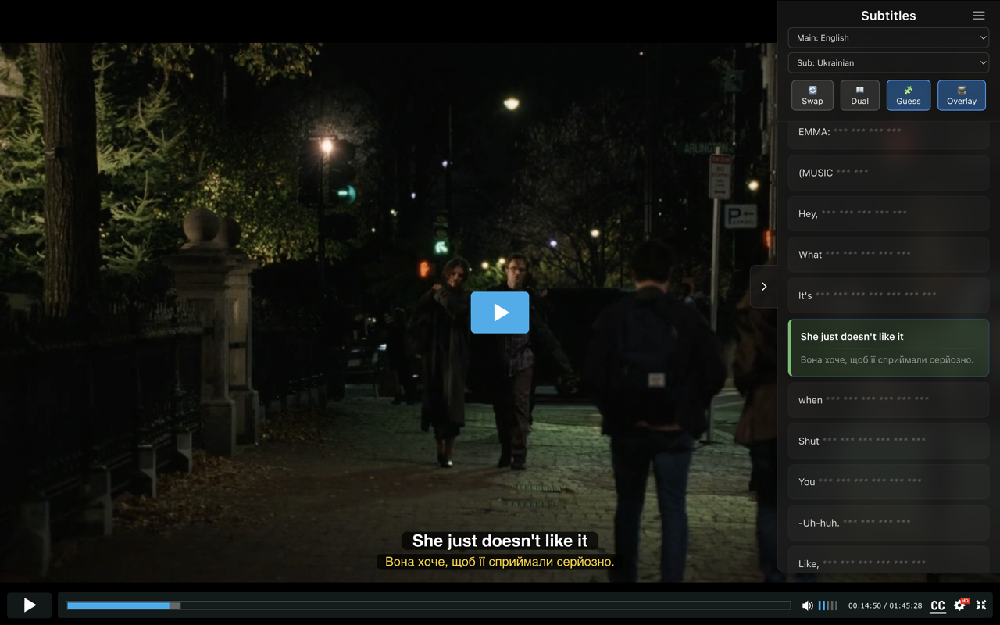

<div align="center">
  
  <h1>Language Learning Transcript Sidebar</h1>
  <p><b>Interactive subtitles and transcripts for effortless language immersion.</b></p>

  [](https://opensource.org/licenses/MIT)
  [](https://chrome.google.com/webstore)
  [](https://vitejs.dev/)
  [](https://www.typescriptlang.org/)
  [](PRIVACY_POLICY.md)
</div>

---

## 🌟 Overview

**Language Learning Transcript Sidebar** is a professional Chrome extension designed to turn your video viewing experience (on platforms like HDRezka) into a powerful learning environment. It automatically intercepts subtitle files, merges them, and displays them in a sleek, synchronized sidebar.

---

## ✨ Key Features

### 📚 Synchronized Transcript Sidebar
The entire video text is available in an interactive sidebar. The current phrase is highlighted in real-time as the video plays.



### 🌐 Dual Subtitles Support
Learn new languages by seeing two translations simultaneously. The extension merges data streams for maximum contextual understanding.

### 🖱️ Interactive Navigation
Click any sentence in the transcript to instantly jump to that specific moment in the video. No more manual seeking!

### 🌗 Premium Dark Mode
A minimalist design that seamlessly integrates with video player interfaces without distracting you from the content.


---

## 🛠 Architecture

The project is built with modern technologies focusing on performance and reliability:

- **Manifest V3**: Compliant with the latest Chrome security standards.
- **Vite + TypeScript**: Fast builds and type-safe development.
- **Network Interceptor**: Smart `.vtt` request interception for clean subtitle data.
- **Vanilla DOM**: Maximum performance without heavy framework overhead.

---

## 🚀 Installation

1. **Clone the repository:**
   ```bash
   git clone https://github.com/akarzhavin/chrome-extension-video-transcripts.git
   ```
2. **Install dependencies:**
   ```bash
   npm install
   ```
3. **Build the project:**
   ```bash
   npm run build
   ```
4. **Load into Chrome:**
   - Open `chrome://extensions/`.
   - Enable **Developer mode**.
   - Click **Load unpacked**.
   - Select the `build` folder from the project root.

---

## 📋 Roadmap
- [ ] Support for YouTube and Netflix
- [ ] Anki integration for quick card creation
- [ ] Built-in dictionary on hover
- [ ] Export transcripts to PDF/Markdown

---

<div align="center">
  <p>Made with ❤️ for language learners everywhere.</p>
</div>
